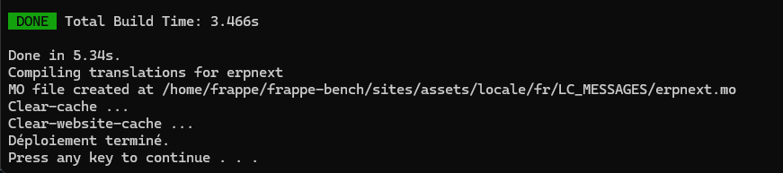
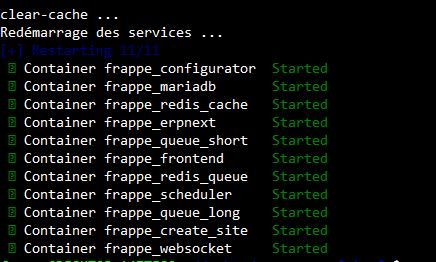

# ERPNext Softia

Ce guide explique comment installer l'application ERPNext Softia

---

## Prérequis

Avant de commencer, assurez-vous que votre machine dispose de :

- **Docker** (version 27.3 ou plus)   
   Installation :  
  - [Installer Docker Desktop sur Windows](https://docs.docker.com/desktop/setup/install/windows-install/)
  - [Installer Docker sur Linux](https://docs.docker.com/engine/install/)  
- **Docker Compose**  (version 2.30 ou plus)  
   Déjà inclus avec Docker Desktop (Windows & Mac). Sur Linux, voir : [Installer Docker Compose](https://docs.docker.com/compose/install/)
- **Git**  
   [Installer Git](https://git-scm.com/downloads)
- **Connexion Internet stable** (pour télécharger les images et dépendances)

### Sous Windows
1. **Installez Docker Desktop** et activez **WSL 2** (obligatoire)  
   [Guide officiel](https://docs.docker.com/desktop/setup/install/windows-install/)  
2. Téléchargez le projet au format ZIP : [erpnext-docker-main.zip](https://github.com/SoftiaFR/erpnext_docker/archive/refs/heads/main.zip)
3. Décompressez le fichier télécharger
4. Dans le dossier décompressé, double-cliquez sur le fichier `deploy-erpnext-softia-windows.bat` et attendre que l'installation soit terminer.

1. Une fois l’installation terminée, ouvrez dans votre navigateur :
   ```
   http://localhost:9090
   ```
   - **Nom d’utilisateur** : `Administrator`  
   - **Mot de passe** : `admin`

---
### Sous Linux / MacOS
1. Clonez le dépôt depuis votre terminal :
   ```bash
   git clone https://github.com/SoftiaFR/erpnext_docker
   cd erpnext_docker
   ```
2. Lancez le script d’installation :
   ```bash
   sudo chmod +x deploy-erpnext_softia.sh
   sudo ./deploy-erpnext_softia.sh
   ```
3. Attendez que des lignes similaires à celles-ci s'affichent : 

4. Accédez à ERPNext Softia dans votre navigateur :
   ```
   http://localhost:9090
   ```
   - **Nom d’utilisateur** : `Administrator`  
   - **Mot de passe** : `admin`

### Pour arrêter l’environnement :
Assurez-vous d’être dans le dossier **décompressé du projet** (erpnext_softia_fr/) avant d’exécuter ces commandes.
```bash
docker compose down
```
### Pour supprimer également les volumes et repartir de zéro :
```bash
docker compose down -v
```
---
